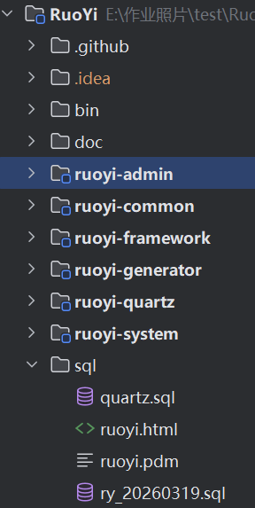
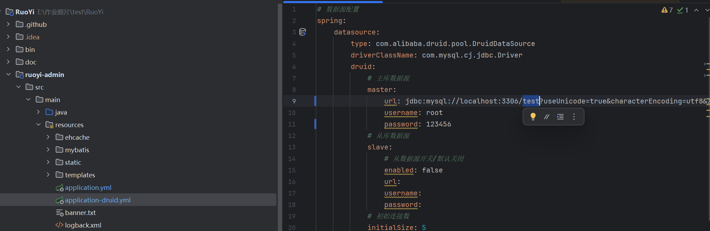

# 若依后台管理系统 + 自动化测试集成工具

> 本目录包含两个项目：若依后台管理系统（RuoYi）及其配套的 Selenium + TestNG 自动化测试 GUI 工具。

```
E:\作业照片\test\
├── RuoYi\                  # 若依后台管理系统（Spring Boot）
├── ruoyi-autotest-gui\     # 自动化测试集成 GUI 工具（Java Swing + Selenium + TestNG）
└── README.md               # 本文件
```

---

## 一、环境要求

| 软件 | 版本要求 | 验证命令 |
|---|---|---|
| **JDK** | 17+ | `java -version` |
| **Maven** | 3.6+ | `mvn -version` |
| **MySQL** | 5.7 / 8.0 | `mysql -u root -p` |
| **Edge 浏览器** | 最新稳定版 | 开始菜单搜索 |
| **JMeter**（性能测试） | 5.6.3 | 可选 |

> JDK 和 Maven 需正确配置 `JAVA_HOME` 和 `MAVEN_HOME` 环境变量。

---

## 二、部署若依后台系统

### 2.1 创建数据库并导入数据
将两个sql文件在MySql中运行


### 2.2 修改数据库连接配置

将test改成你在上一步建的数据库的名字
编辑 `RuoYi/ruoyi-admin/src/main/resources/application-druid.yml`：

```yaml
spring:
    datasource:
        druid:
            master:
                url: jdbc:mysql://localhost:3306/test?useUnicode=true&characterEncoding=utf8&zeroDateTimeBehavior=convertToNull&useSSL=true&serverTimezone=GMT%2B8
                username: root        # ← 改成你的 MySQL 用户名
                password: 123456      # ← 改成你的 MySQL 密码
```

### 2.3 启动若依系统

```powershell
cd E:\作业照片\test\RuoYi
mvn spring-boot:run
```

等控制台输出 `Started RuoYiApplication` 后，浏览器访问：

```
http://localhost
```

> **默认账号**：`admin`　**默认密码**：`admin123`
>
> **注意**：验证码已关闭（`captchaEnabled: false`），密码错误锁定已禁用（`maxRetryCount: 99999`）。
>
> 若依运行在 **80 端口**。

---

