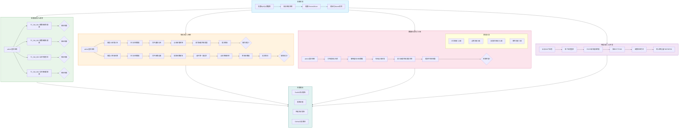

# 组员4 - 参数与通知公告模块测试业务流程图

```mermaid
flowchart TB
    subgraph S1["准备阶段"]
        direction LR
        A1["配置MySQL数据库"] --> A2["启动若依系统"]
        A2 --> A3["配置ChromeDriver"]
        A3 --> A4["初始化Maven项目"]
    end

    subgraph S2["单模块测试 4用例"]
        B0["admin登录系统"]
        B0 --> B1["TC_SM_001 参数按名称搜索"]
        B0 --> B2["TC_SM_002 参数按键名搜索"]
        B0 --> B3["TC_SM_003 公告列表查询"]
        B0 --> B4["TC_SM_004 公告按标题搜索"]
        B1 --> B1R{"验证结果"}
        B2 --> B2R{"验证结果"}
        B3 --> B3R{"验证结果"}
        B4 --> B4R{"验证结果"}
    end

    subgraph S3["集成测试 2用例"]
        C0["admin登录系统"]
        C0 --> C1["深度3: 新增公告"]
        C1 --> C1A["进入系统管理"]
        C1A --> C1B["打开通知公告"]
        C1B --> C1C["点击新增按钮"]
        C1C --> C1D["填写标题内容类型"]
        C1D --> C1E["提交保存"]
        C1E --> C1R{"操作成功?"}

        C0 --> C2["深度4: 修改参数"]
        C2 --> C2A["进入系统管理"]
        C2A --> C2B["打开参数设置"]
        C2B --> C2C["搜索参数键名"]
        C2C --> C2D["选中第一条记录"]
        C2D --> C2E["点击修改按钮"]
        C2E --> C2F["修改参数值"]
        C2F --> C2G["提交保存"]
        C2G --> C2R{"操作成功?"}
    end

    subgraph S4["数据驱动测试 25组"]
        D0["admin登录系统"]
        D0 --> D1["打开通知公告页"]
        D1 --> D2["循环遍历25组数据"]
        D2 --> D3["每组点击新增"]
        D3 --> D4["填入标题内容类型状态"]
        D4 --> D5["提交并检测结果"]
        D5 --> D6{"预期匹配?"}

        subgraph S4A["数据分类"]
            DN["正常场景 10组"]
            DE["边界场景 6组"]
            DT["类型状态组合 4组"]
            DX["额外场景 5组"]
        end
    end

    subgraph S5["性能测试 130并发"]
        E0["启动130个线程"]
        E0 --> E1["每个线程登录"]
        E1 --> E2["POST请求通知列表"]
        E2 --> E3["验证HTTP200"]
        E3 --> E4["收集响应时间"]
        E4 --> E5["统计吞吐量P90P95P99"]
    end

    subgraph S6["结果输出"]
        F1["TestNG测试报告"]
        F2["截图证据"]
        F3["性能测试报告"]
        F4["GitHub分支推送"]
    end

    S1 --> S2
    S1 --> S3
    S1 --> S4
    S1 --> S5

    S2 --> S6
    S3 --> S6
    S4 --> S6
    S5 --> S6

    style S1 fill:#e1f5fe,stroke:#0288d1
    style S2 fill:#e8f5e9,stroke:#388e3c
    style S3 fill:#fff3e0,stroke:#f57c00
    style S4 fill:#fce4ec,stroke:#c2185b
    style S5 fill:#f3e5f5,stroke:#7b1fa2
    style S6 fill:#e0f2f1,stroke:#00695c
```
